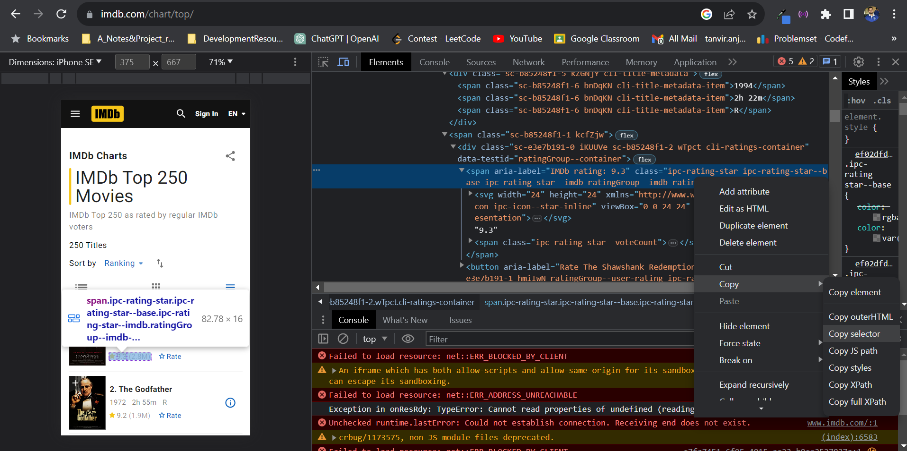

# 📽️ WebParsingNodeJS

Extract IMDB ratings and release years of top movies using **Node.js**, **Selenium WebDriver**, and store the results in an **Excel (.xlsx)** file.

> © COPYRIGHT: [**Tanvir Anjom Siddique (Alvi)**](https://tanvirsweb.github.io/)

---

## 🎥 Demo Video

Watch the full project in action here:
🔗 [https://youtu.be/yTJUheqS9wg](https://youtu.be/yTJUheqS9wg)

[](https://youtu.be/yTJUheqS9wg)

---

## 📌 Overview

This project uses **Selenium WebDriver** to scrape movie data (title, rating, and release year) from the [IMDB Top Movies](https://www.imdb.com/chart/top) page and saves the extracted data into an Excel file using **ExcelJS**.

> ⚠️ _Note_: IMDB frequently updates its frontend, so **CSS selectors may break**. If that happens:
>
> - Open the website
> - Right-click on the data element → **Inspect**
> - Right-click the tag → **Copy → Copy selector**
> - Replace the outdated selector in your code with the new one

## 

## ⚙️ Setup Instructions

### 1️⃣ Initialize Node Project

```bash
npm init -y
```

### 2️⃣ Install Required Packages

```bash
npm install selenium-webdriver exceljs
```

### 3️⃣ Web Driver Setup

Ensure you have the correct browser driver installed and added to your system’s PATH:

- For Chrome: [Download ChromeDriver](https://sites.google.com/a/chromium.org/chromedriver/)
- For Firefox: [Download GeckoDriver](https://github.com/mozilla/geckodriver/releases)

---

## 📄 File Structure

```
WebParsingNodeJS/
│
├── TopIMDB_MovieInfo.js     # Main script for scraping and saving data
├── package.json             # Node.js project config
├── Top_IMDB_Movies.xlsx     # Output Excel file
└── README.md                # Project documentation
```

---

## 🚀 Run the Script

After creating your script (`TopIMDB_MovieInfo.js`) and saving the code, run it with:

```bash
node TopIMDB_MovieInfo.js
```

If configured correctly, it will:

- Open the browser using Selenium
- Scrape movie titles, ratings, and release years
- Export the collected data into `Top_IMDB_Movies.xlsx`

---

## 📦 Dependencies

| Package              | Description                                                   |
| -------------------- | ------------------------------------------------------------- |
| `selenium-webdriver` | Automates browser interaction                                 |
| `exceljs`            | Used to generate and manipulate Excel files in `.xlsx` format |

---

## 👨‍💻 Author

**Tanvir Anjom Siddique (Alvi)**
📫 [tanvir.anjom.siddique@gmail.com](mailto:tanvir.anjom.siddique@gmail.com)
🌐 [Portfolio Website](https://tanvirsweb.github.io/)
💼 [LinkedIn](https://bd.linkedin.com/in/tanvir-anjom-siddique)

---

## 📃 License

This project is licensed under the **MIT License**. See `LICENSE` for more details.
© 2023 Tanvir Anjom Siddique (Alvi)

---
